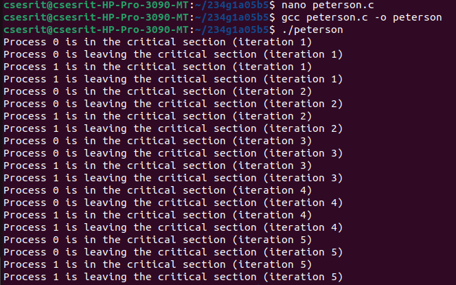

# PETERSEN ALGORITHM FOR CRITICAL SECTION
## (VIRTUAL LAB2)
###code
#
#include <stdio.h>
#include <pthread.h>
#include <stdbool.h>
#include <unistd.h>

#define NUM_ITERATIONS 5

volatile bool flag[2] = {false, false};
volatile int turn;

void enter_critical_section(int process) {
    int other = 1 - process;
    flag[process] = true;
    turn = other;
    while (flag[other] && turn == other);
}

void exit_critical_section(int process) {
    flag[process] = false;
}

void* process_function(void* arg) {
    int process = *(int*)arg;
    for (int i = 0; i < NUM_ITERATIONS; i++) {
        enter_critical_section(process);
        printf("Process %d is in the critical section (iteration %d)\n", process, i + 1);
        usleep(100000); // Simulating some work in critical section
        printf("Process %d is leaving the critical section (iteration %d)\n", process, i + 1);
        exit_critical_section(process);
        usleep(100000); // Simulating some work in non-critical section
    }
    return NULL;
}

int main() {
    pthread_t t0, t1;
    int p0 = 0, p1 = 1;
    
    pthread_create(&t0, NULL, process_function, &p0);
    pthread_create(&t1, NULL, process_function, &p1);
    
    pthread_join(t0, NULL);
    pthread_join(t1, NULL);
    
    return 0;
}

### OUTPUT
   
